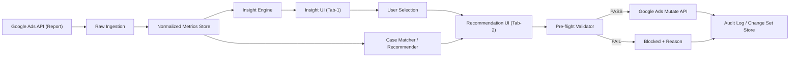

# Google Ads 인사이트 기반 자동 셋팅 시스템 설계

## 1. 목표
- 기존 Google Ads 설정/성과 데이터를 분석해 최근 성과 인사이트를 생성한다.
- 사용자가 선택한 인사이트에 대해 과거 유사사례를 근거로 신규 캠페인 설정값을 추천한다.
- 추천 설정값이 정합성 검증을 통과하면 Google Ads API를 통해 자동 반영한다.
- 모든 단계(분석, 추천, 검증, 적용)를 추적 가능한 감사 로그로 남긴다.

## 2. 핵심 요구사항
- 설명가능성: 추천값마다 근거 사례(case)와 성과 개선치를 같이 제공해야 한다.
- 정합성: 데이터 타입/단위/키 일관성, 중복 적용 방지(idempotency), 시점 기준 재현 가능성 보장.
- 안전성: 사전 검증 실패 시 자동 반영 차단, 수동 승인 단계 유지.
- 운영성: 실패 시 재시도 가능하며, 이전 설정으로 롤백 가능한 변경셋(change set) 구조.

## 3. 상위 아키텍처

## 4. 데이터 도메인 설계

### 4.1 엔티티
- `campaign_settings_snapshot`
  - 기준 시점의 캠페인 설정값(예산, 입찰전략, 타겟, 스케줄, 제외키워드)
  - `snapshot_id`, `campaign_id`, `snapshot_at` 복합 키 권장
- `campaign_performance_snapshot`
  - 기간별 성과 집계(노출, 클릭, 비용, 전환, 전환가치, ROAS, CPA)
  - `campaign_id`, `window_start`, `window_end`, `attribution_model` 필수
- `insight`
  - 이상징후/기회 신호와 기대효과
  - `insight_id`, `signal_key`, `confidence`, `evidence[]`, `expected_impact`
- `historical_case`
  - 유사 조건에서 실제 적용된 설정과 전후 성과
  - `case_id`, `signal_key`, `before`, `applied_settings`, `after14d`
- `change_set`
  - API 반영 요청 단위
  - `change_set_id`, `request_id`, `campaign_id`, `payload_hash`, `status`

### 4.2 식별자/버전 규칙
- 모든 주요 엔티티는 전역 유일 ID 사용(`ins_`, `case_`, `chg_`, `req_` prefix).
- 추천 계산은 반드시 특정 `snapshot_id`와 `insight_id`에 고정해 재현 가능해야 한다.
- 같은 요청 재전송 시 `request_id + payload_hash`로 중복 반영 차단.

## 5. 정합성 보장 설계

### 5.1 스키마 정합성
- 단위 강제:
  - 예산/비용/매출: `KRW`
  - 비율: `%` 또는 `x(ROAS)`를 컬럼 분리
- 누락/범위 검증:
  - `daily_budget > 0`, `target_roas in [min,max]` (해당 전략일 때만)
  - 필수 배열(`negative_keywords`) 최소 개수

### 5.2 시점 정합성
- 인사이트 생성 시점(`generated_at`)과 추천 생성 시점 동일 스냅샷 사용.
- UI 표시 수치와 API 페이로드 수치는 같은 스냅샷 버전에서 파생되도록 고정.

### 5.3 연산 정합성
- 추천 연산은 순수함수로 구성:
  - 입력: `insight + current_setting + matched_cases`
  - 출력: `recommended_setting + source_case_ids + confidence`
- 동일 입력이면 동일 출력 보장(랜덤 요소 배제).

### 5.4 적용 정합성
- `Pre-flight` 통과 조건:
  - 예산 변경폭 제한(예: ±30%)
  - 타겟 ROAS 범위
  - 제외키워드 최소 개수
  - 캠페인 잠금 상태 확인
- PASS일 때만 Mutate API 실행.
- 적용 성공 시 `change_set` 기록, 실패 시 이유 코드와 함께 감사 로그 저장.

## 6. 추천 알고리즘(초기 버전)
- `signal_key` 일치 사례를 후보군으로 선택.
- 성과 개선치(예: `revenueLiftPct`) 상위 사례 중심 가중 평균으로 예산/ROAS 추천.
- 제외키워드는 현재값 + 사례값을 합집합으로 제안.
- 상용화 시 시장/제품/시즌 유사도 점수까지 포함해 랭킹 고도화.

## 7. API 적용 플로우
1. `dry-run`(validate only) 요청으로 정책 위반 여부 확인
2. 이상 없으면 `commit` 요청으로 실반영
3. 응답의 `request_id`, `change_set_id`, `applied_at` 저장
4. 후속 모니터링(1일/7일)으로 기대효과 대비 편차 감시

## 8. 장애/예외 처리
- API 타임아웃: `request_id` 기준 재시도(최대 N회) 후 실패 로그 기록
- Partial failure: 실패 항목만 분리 재시도, 성공 항목은 재적용 금지
- 데이터 지연: 최신 스냅샷 미도착 시 추천 생성을 차단하고 상태 표시
- 정책 위반: 자동 반영 차단 + 수정 가이드 반환

## 9. 운영 체크리스트
- 매일 데이터 품질 점검:
  - 중복 키, 음수 비용, 비정상 CTR/ROAS 값
- 주간 추천 성능 점검:
  - 추천 채택률, 적용 성공률, 적용 후 14일 성과
- 월간 룰/가드레일 점검:
  - 과도한 예산변경 발생률, 검증 차단율, 롤백 비율

## 10. 본 저장소 데모와의 매핑
- 설계 문서 기반 예시 데이터:
  - `/Users/fin01-eastsky21/workspace/marketing_dashboard/app/data/googleAdsDemoData.js`
- 탭형 데모 UI:
  - `/Users/fin01-eastsky21/workspace/marketing_dashboard/components/GoogleAdsAutomationTab.js`
- 실제 동작 흐름:
  - 탭1: 인사이트 선택
  - 탭2: 사례 기반 추천 + 정합성 검증
  - 탭3: 모의 API 적용 + 감사 로그 확인
